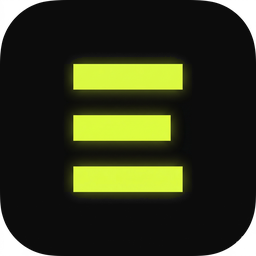
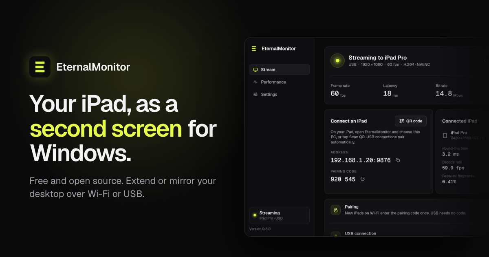
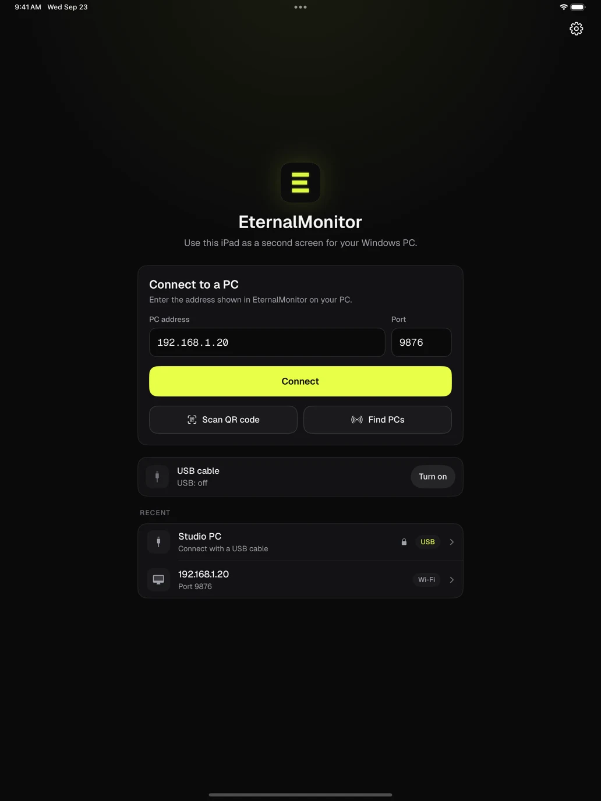
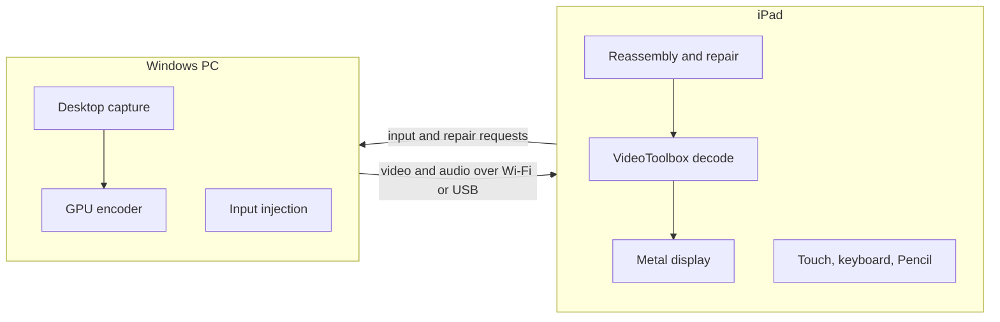

<div align="center">



# EternalMonitor

Mirror or extend your Windows desktop onto an iPad over Wi-Fi or USB,<br>
and control the PC with touch, a keyboard or Apple Pencil.

[](https://github.com/sidebandstudio/EternalMonitor/releases)
[](https://github.com/sidebandstudio/EternalMonitor/actions/workflows/ci.yml)
[](LICENSE)
[](#download)
[](https://eternalmonitor.dev)

[Download](#download) · [Setup guide](SETUP.md) · [Website](https://eternalmonitor.dev) · [Release notes](RELEASE_NOTES.md)

</div>

<p align="center">
  
</p>

EternalMonitor streams your Windows desktop to an iPad and sends your input back.
A small Windows app captures the screen and encodes it on your graphics card. The
iPad app decodes the video in hardware and draws it with Metal, and every tap,
keystroke and Pencil stroke travels back to the PC. It is free, open source under
the MIT license, and needs no account.

## Features



- **Extend or mirror.** Add the iPad as an extra display beside your monitor, or
  mirror any screen you have. The extra display exists only while the iPad is
  connected, so Windows never keeps a phantom monitor around.
- **Wi-Fi or USB.** Stream over your home network, or plug in a cable for a
  steadier picture that also charges the iPad. A cable takes over a running
  Wi-Fi session, and unplugging it falls back to Wi-Fi.
- **Touch, keyboard and pointer.** Tap to click, drag, scroll with two fingers and
  hold to right-click. Hardware keyboards, trackpads and mice work too, with
  sticky modifiers and middle-click.
- **Apple Pencil as a real pen.** Windows receives Windows Ink pressure and tilt.
  Drawing mode ignores your palm on the canvas, and Clip Studio Paint works with
  its Tablet PC setting.
- **PC audio.** Sound plays on the iPad as Opus, with a jitter buffer and loss
  concealment. You can mute it without stopping the video.
- **Loss repair for real Wi-Fi.** When a packet goes missing, the iPad asks for
  that fragment again right away, so one dropped packet rarely costs a frame. The
  bitrate adapts between 4 and 50 Mbps.
- **Your GPU does the work.** NVIDIA NVENC, AMD AMF or Intel Quick Sync encode
  H.264 by default, or HEVC if you prefer it, at 30, 60, 90 or 120 fps.
- **Pairing.** The first Wi-Fi connection asks for a six-digit code or a QR scan.
  After that the iPad remembers the PC. USB needs no code.

<br clear="right">

## Download

| | Requirements | Get it |
| --- | --- | --- |
| **Windows** | Windows 10 (version 1809 or later) or Windows 11, 64-bit, with an NVIDIA, AMD or Intel GPU | [EternalMonitor-Setup.exe](https://github.com/sidebandstudio/EternalMonitor/releases/tag/v0.3.0) (v0.3.0 current stable) |
| **iPad** | iPadOS 17 or later | [TestFlight v0.3.0, build 143](https://testflight.apple.com/join/ppc9QfXc). External installation opens after Apple approves the build. |

Install both apps from the same version. The older v0.1 releases use a different
protocol and cannot connect to the v0.3 iPad app.

The installer is not code-signed yet, so Windows SmartScreen asks before it runs.
Choose **More info**, then **Run anyway**, only after checking that the file's
SHA-256 matches the one on the [release page](https://github.com/sidebandstudio/EternalMonitor/releases).

For USB you also need Apple's free [Apple Devices](https://apps.microsoft.com/detail/9np83lwlpz9k)
app, open while you stream. Windows can only reach an iPad over a cable through
it, and EternalMonitor tells you when it is closed or missing.

**Next, follow the [setup guide](SETUP.md).** It walks through installing both
apps, pairing, USB, the extended display and drawing, with the exact button names
you will see.

## Status

v0.3.0 is the current stable release, paired with iPad TestFlight build 143.
Its Windows installer is unchanged from v0.3.0-rc.1. On 2026-09-24 it passed the automated tests
on a reference PC with GeForce RTX 5080 and Radeon graphics and on a physical
iPad Pro.
Those included 30-minute runs at about 58 fps, one over Wi-Fi at 3440×1440 and
one over USB at 2732×2048. Testers are now checking what needs hands on the
device, such as drawing in Clip Studio Paint and audio sync.
[docs/hardware-verification.md](docs/hardware-verification.md) has every result,
including the failures.

Known limits:

- The stream is not encrypted. Pairing keeps other devices out, so use a network
  you trust, such as your home Wi-Fi.
- The Windows app is the only host. The host builds on macOS for development,
  but there it streams a test pattern instead of your screen.
- Apple Pencil (USB-C) has no pressure sensor, so its strokes keep one width.

## How it works



The Windows host is written in Rust. It captures the desktop with DXGI, encodes on
the GPU through FFmpeg, and sends each frame as numbered UDP fragments. Over USB
the same messages travel through a framed tunnel that Apple's device service
provides. The iPad app is native Swift. It reassembles fragments, requests any
that are missing, decodes with VideoToolbox and renders with Metal. Input and
receiver reports go back on the same session, and the host uses those reports
to adapt the bitrate.

[ARCHITECTURE.md](ARCHITECTURE.md) describes the pipeline and protocol v2, and
[docs/decisions.md](docs/decisions.md) explains why each part works the way it
does.

## Build from source

The workspace holds the Rust host (`host/`), the protocol crate `eternal-wire`
(`proto/`) and the Swift iPad app (`ios/`).

<details>
<summary><b>Windows host</b></summary>

Requirements: Windows 10 version 1809 or later, Rust 1.98.0 (pinned by
`rust-toolchain.toml`, MSVC), an FFmpeg **7.1 shared** SDK and LLVM/libclang for
bindgen.

```powershell
# Point the build at your FFmpeg 7.1 shared SDK (the folder with bin\avcodec-*.dll)
$env:FFMPEG_DIR = "C:\ffmpeg"
cargo build --release -p eternal-host
.\target\release\eternal-host.exe          # optional port argument, default 9876
```

`scripts\build-installer.ps1` builds the full Setup.exe with Inno Setup and the
same `FFMPEG_DIR`. `scripts\package.ps1` builds a bare zip.

</details>

<details>
<summary><b>macOS development loop</b> (no Windows needed)</summary>

On macOS the host swaps screen capture for a synthetic test pattern. The
protocol, encoder, transport and supervisor all run for real.

```bash
brew install ffmpeg@7 pkgconf xcodegen
export PKG_CONFIG_PATH=/opt/homebrew/opt/ffmpeg@7/lib/pkgconfig
cargo test --workspace          # unit, golden-vector and synthetic end-to-end tests
ETERNAL_CAPTURE=synthetic cargo run -p eternal-host
```

If Xcode's command-line tools are the selected developer directory, prefix Xcode
commands with `DEVELOPER_DIR=/Applications/Xcode.app/Contents/Developer`.

</details>

<details>
<summary><b>iPad app</b></summary>

```bash
cd ios
xcodegen generate               # project.yml is the source of truth
xcodebuild test -project EternalMonitor.xcodeproj -scheme EternalMonitor \
  -destination 'platform=iOS Simulator,name=iPad Pro 11-inch (M4)'
```

To run on a physical iPad, open the generated project in Xcode and pick your own
signing team.

</details>

<details>
<summary><b>End-to-end tests</b></summary>

```bash
./scripts/e2e_ios.sh              # synthetic host to the iPad simulator, H.264
EM_CODEC=hevc ./scripts/e2e_ios.sh
scripts/test_ios.sh               # iPad unit and UI tests
scripts/e2e_matrix.sh             # UDP, loss, burst, USB, audio, pairing, input, lifecycle
scripts/soak.sh 1800              # 30-minute frame-rate and memory check
```

Each row checks the decoded frame rate (at least 55 fps), drops, repairs and the
rendered pixels. `e2e_matrix.sh --real` runs the Windows hardware rows through the
runner in `scripts/win/`; read [scripts/win/README.md](scripts/win/README.md)
first. CI runs the Rust suites on Linux, macOS and Windows, the iPad tests and a
streaming system test on every pull request.

</details>

<details>
<summary><b>Host environment variables</b></summary>

| Variable | Effect |
| --- | --- |
| `ETERNAL_ENCODER` | Force an encoder (`h264_nvenc`, `h264_amf`, `h264_qsv`, `libx264`) |
| `ETERNAL_HEVC` | `1` or `0` overrides the HEVC preference |
| `ETERNAL_FPS` | Override the host frame rate; the iPad's preference still caps it |
| `ETERNAL_INPUT` | Encoder input: `yuv420` (default), `auto` or `bgra` |
| `ETERNAL_MAX_DGRAM` | Media datagram size, 576 to 1400 bytes |
| `ETERNAL_CAPTURE` | `synthetic` swaps DXGI for a generated test pattern |
| `ETERNAL_AUDIO` | `synthetic` selects the deterministic audio test source |
| `ETERNAL_HEADLESS` | `1` runs without the window; Ctrl+C shuts down cleanly |
| `ETERNAL_ABR` | `0` disables adaptive bitrate |
| `ETERNAL_VDD_TIMEOUT_SECS` | How long to wait for the virtual display to attach |
| `ETERNAL_AMF_DIAG` | `1` writes AMF bitstream diagnostics |
| `ETERNAL_LEGACY_PTS` | `1` restores the old frame-counter timestamps |
| `ETERNAL_DROP`, `ETERNAL_REORDER`, `ETERNAL_JITTER_MS` | Test only: inject loss, reordering or jitter |
| `ETERNAL_USB_DIRECT` | Test only: a TCP endpoint in place of the USB tunnel |

</details>

## Documentation

| Document | What it covers |
| --- | --- |
| [SETUP.md](SETUP.md) | Step-by-step setup for anyone, including USB and drawing |
| [ARCHITECTURE.md](ARCHITECTURE.md) | The pipeline, protocol v2 and each component |
| [docs/decisions.md](docs/decisions.md) | Why things are the way they are, with measurements |
| [docs/pencil-drawing.md](docs/pencil-drawing.md) | Apple Pencil, Windows Ink and Clip Studio Paint |
| [docs/pairing.md](docs/pairing.md), [docs/keyboard-input.md](docs/keyboard-input.md), [docs/host-settings.md](docs/host-settings.md), [docs/audio-codec.md](docs/audio-codec.md) | Feature details |
| [docs/hardware-verification.md](docs/hardware-verification.md) | The release test record and the hands-on checklist |
| [docs/beta-testing.md](docs/beta-testing.md) | Running a beta: TestFlight, signing and what to test |
| [docs/design.md](docs/design.md) | The shared look of the apps and the website |
| [RELEASE_NOTES.md](RELEASE_NOTES.md) | What changed in each version |

## Contributing

Contributions are welcome, from transport and encoders to rendering and docs.
Read [CONTRIBUTING.md](CONTRIBUTING.md) before opening a pull request. To talk an
idea through first, message `aldobenches285` on Discord.

Found a bug? [Open an issue](https://github.com/sidebandstudio/EternalMonitor/issues/new/choose)
with both app versions and the host log. Report security problems privately as
described in [SECURITY.md](SECURITY.md).

## License

EternalMonitor is released under the [MIT License](LICENSE), © 2026 Ali Younes.
The Windows installer also ships third-party components under their own licenses,
including the [Virtual Display Driver](https://github.com/VirtualDrivers/Virtual-Display-Driver)
and FFmpeg.

Built by Ali Younes ([@whoisaldo](https://github.com/whoisaldo)). Questions go to
[aliyounes@eternalreverse.com](mailto:aliyounes@eternalreverse.com).
